# Node.js JWT Authentication

A modular JWT authentication backend built with **Node.js, Express, PostgreSQL, and Redis**.

This project demonstrates a secure authentication architecture using **short-lived access tokens**, **refresh-token rotation**, **server-side refresh-token state**, **refresh-token revocation**, **refresh-token reuse detection**, **HTTP-only cookies**, and **Redis-based login rate limiting**.

---

## Features

- User registration
- User login
- JWT access tokens
- JWT refresh tokens
- Short-lived access tokens
- HTTP-only refresh-token cookies
- Refresh-token rotation
- Refresh-token revocation
- Refresh-token reuse detection
- Redis-based refresh-token state
- PostgreSQL user persistence
- Redis-based login rate limiting
- IP-based rate limiting
- Account-based rate limiting
- Atomic Redis Lua rate-limiting operation
- Protected routes
- Logout
- Layered backend architecture

---

# Architecture

The application follows a layered backend architecture.

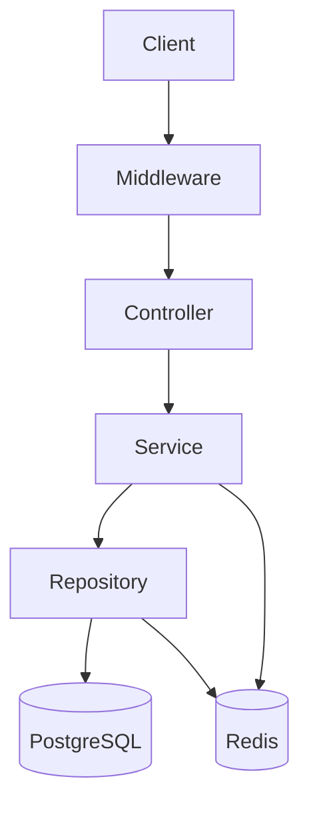

### Responsibilities

| Layer | Responsibility |
|---|---|
| Middleware | Authentication and rate limiting |
| Controller | HTTP request/response handling |
| Service | Authentication and business logic |
| Repository | PostgreSQL and Redis operations |
| Utils | JWT, hashing, and reusable helpers |
| PostgreSQL | Persistent user data |
| Redis | Refresh-token state and rate limiting |

---

# Project Structure

```text
node-jwt-authentication/
│
├── controllers/
│   ├── authController.js
│   └── userController.js
│
├── database/
│   └── db.js
│
├── middleware/
│   ├── loginRateLimiter.js
│   └── verifyAcces.js
│
├── repostiories/
│   ├── tokenRepository.js
│   └── userRepository.js
│
├── services/
│   ├── authService.js
│   ├── ratelimiterService.js
│   └── userService.js
│
├── utils/
│   ├── jwtUtils.js
│   ├── hashUtil.js
│   └── ratelimitUtil.js
│
├── redis/
│   ├── redisClient.js
│   └── scripts/
│       └── dualLeakyBucket.lua
│
├── app.js
├── package.json
├── package-lock.json
└── .gitignore
```

---

# Authentication Architecture

The project uses a hybrid authentication model.

The access token is **stateless**, while the refresh token has **server-side state stored in Redis**.

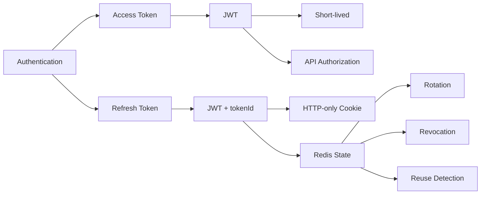

This provides the scalability of stateless access tokens while maintaining server-side control over long-lived refresh tokens.

---

# Authentication Flow

The complete authentication lifecycle is:

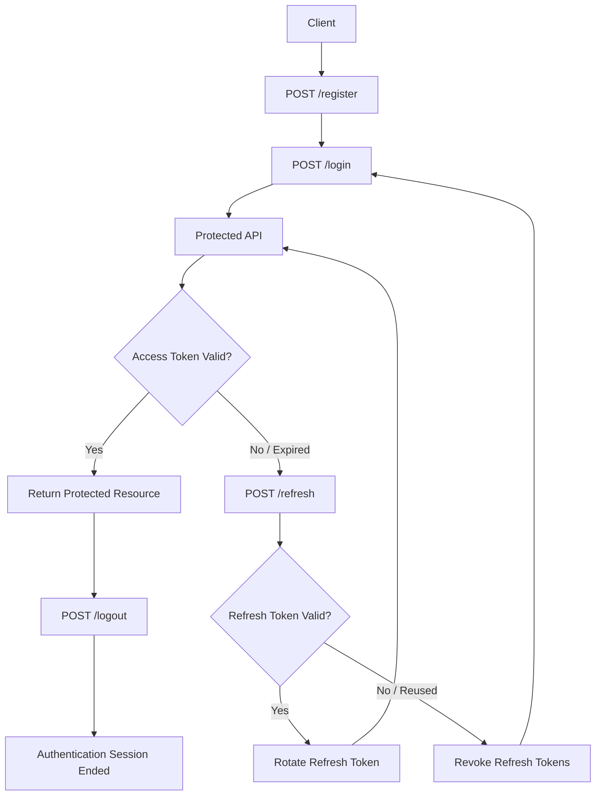

---

# 1. Registration

The registration endpoint creates a new user.

```http
POST /register
Content-Type: application/json
```

Request:

```json
{
  "username": "john",
  "password": "password123"
}
```

### Registration Flow

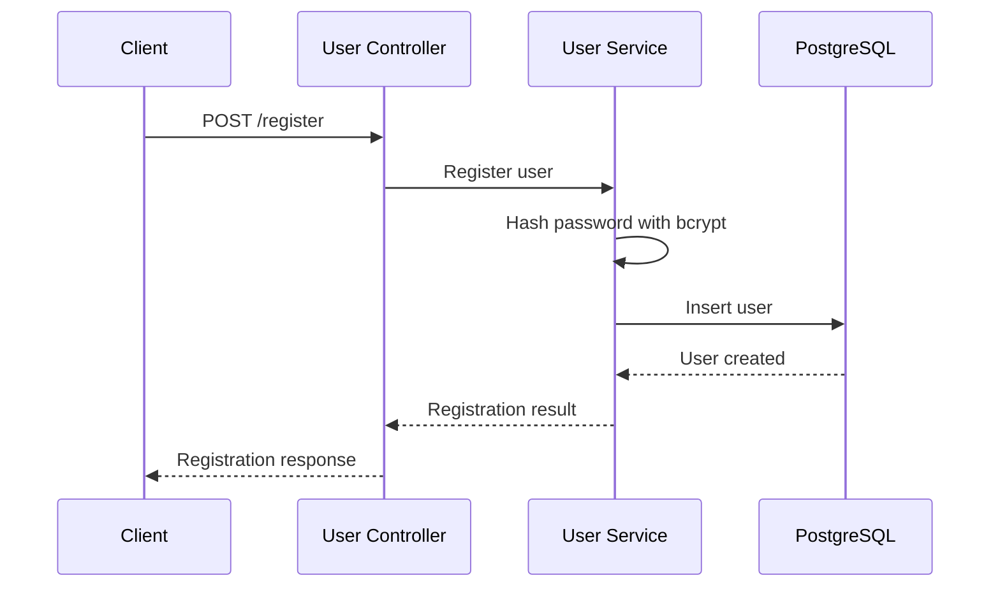

The password is hashed before it is stored in PostgreSQL.

```text
Password
   ↓
bcrypt
   ↓
Password Hash
   ↓
PostgreSQL
```

---

# 2. Login

The login endpoint is protected by the Redis-based rate limiter.

```http
POST /login
Content-Type: application/json
```

Request:

```json
{
  "username": "john",
  "password": "password123"
}
```

### Login Flow

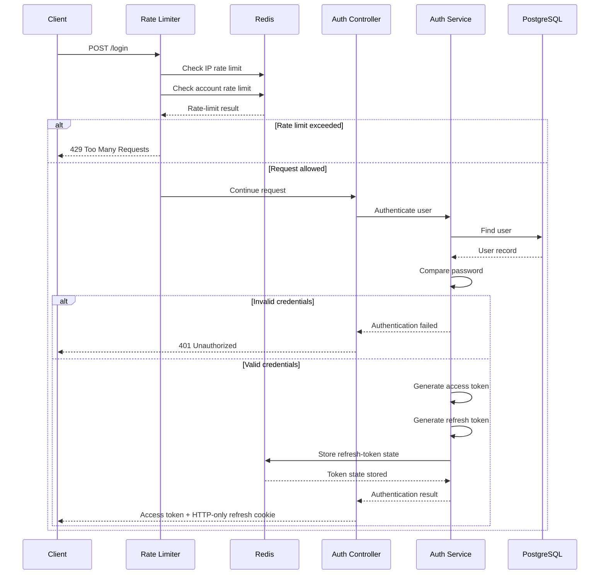

### Important

IP and account identifiers are used for **rate limiting**, not as authentication identity checks.

The login process does not compare the current IP/User-Agent against a previous session.

---

# 3. Access Token

The access token is a short-lived JWT used to authorize protected API requests.

The current implementation uses a **15-minute expiration**.

Example payload:

```json
{
  "userId": "...",
  "username": "...",
  "iat": "...",
  "exp": "..."
}
```

The access token is signed using:

```text
ACCESS_SECRET_KEY
```

### Access Token Characteristics

```text
JWT
 ↓
Stateless
 ↓
Short-lived
 ↓
Used for API authorization
```

Because the access token is short-lived, the impact of a stolen access token is limited by its expiration time.

---

# 4. Refresh Token

The refresh token is used to obtain a new access token after the access token expires.

The current implementation uses a **7-day expiration**.

Each refresh token contains a unique `tokenId`.

The token is signed using:

```text
REFRESH_SECRET_KEY
```

The refresh token is stored in an HTTP-only cookie.

The server stores the corresponding refresh-token state in Redis.

### Redis Key

```text
refresh:<tokenId>
```

### Example Redis State

```json
{
  "userId": 123,
  "valid": true
}
```

The refresh-token record is temporary state and can expire automatically through Redis TTL.

---

# 5. Accessing Protected Routes

Protected routes require an access token.

Example:

```http
GET /home
Authorization: Bearer <access-token>
```

### Protected Request Flow

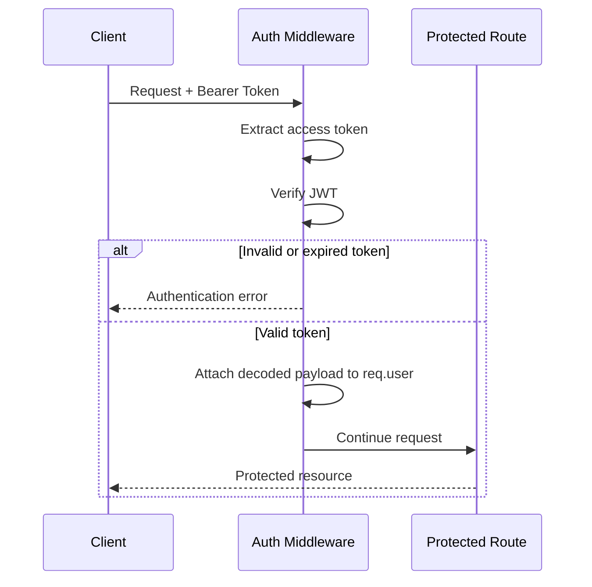

The access token can be verified without querying Redis for every protected request.

---

# 6. Refresh Token Flow

When the access token expires, the client sends:

```http
POST /refresh
```

The browser sends the refresh token through the HTTP-only cookie.

### Refresh Flow

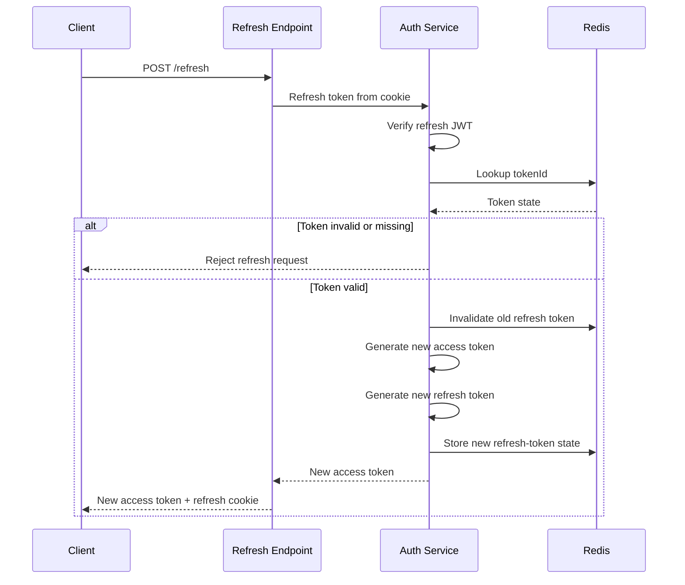

---

# 7. Refresh Token Rotation

Refresh-token rotation means that a refresh token is invalidated when it is successfully used.

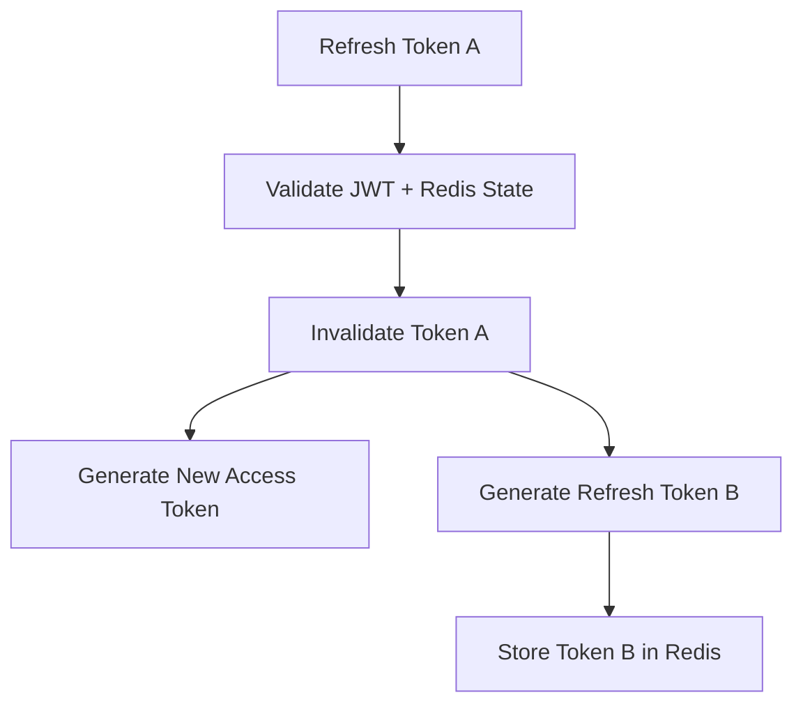

The lifecycle becomes:

```text
Refresh Token A
       ↓
      Use
       ↓
   Invalidate
       ↓
Refresh Token B
       ↓
      Use
       ↓
Refresh Token C
```

This prevents the same refresh token from being continuously reused.

---

# 8. Refresh Token Reuse Detection

Refresh-token rotation also enables reuse detection.

Consider this scenario:

```text
                     Refresh Token A
                           │
                ┌──────────┴──────────┐
                │                     │
          Legitimate Client       Attacker
                │                     │
                ▼                     │
              Uses A                  │
                │                     │
                ▼                     │
          A invalidated               │
                │                     │
                ▼                     │
          Token B issued              │
                                      │
                                      ▼
                                Attempts A
                                      │
                                      ▼
                              A is invalid
                                      │
                                      ▼
                              Reuse detected
```

### Reuse Detection Flow

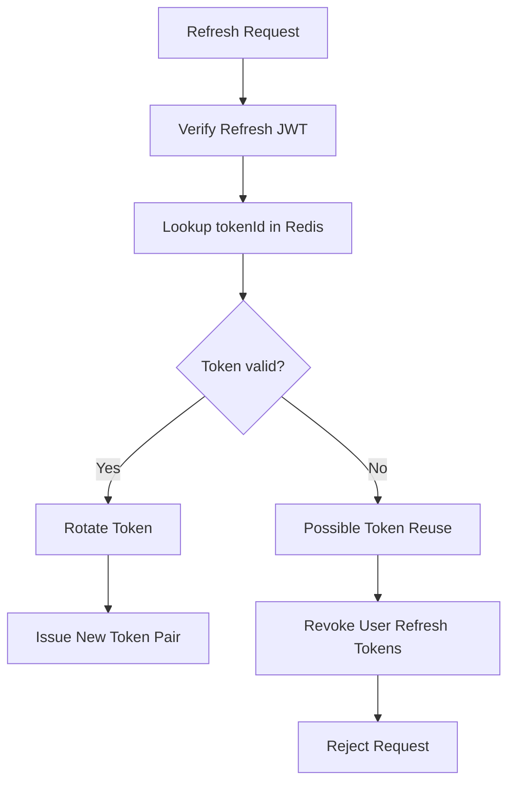

When a previously invalidated refresh token is presented again, the application can treat it as a potential compromise and revoke the user's refresh-token state.

---

# 9. Logout

The logout endpoint requires a valid access token.

```http
POST /logout
Authorization: Bearer <access-token>
```

### Logout Flow

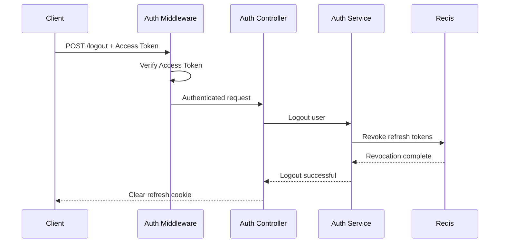

After logout, previously issued refresh tokens are no longer usable.

---

# 10. Login Rate Limiting

The login endpoint uses Redis-based rate limiting to protect against excessive authentication attempts.

The limiter considers two dimensions:

```text
IP Address
+
Account Identifier
```

### Rate Limiting Flow

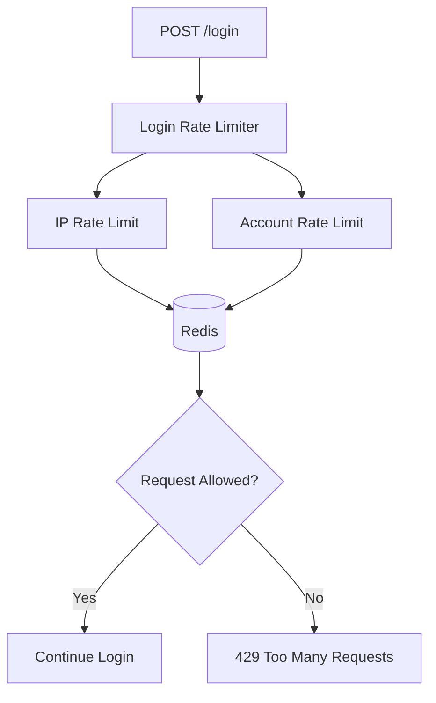

---

# 11. IP-Based Rate Limiting

The client IP is used as one of the rate-limit dimensions.

Example Redis key:

```text
rate_limit:login:ip:<ip>
```

The purpose of the IP address here is:

- Prevent brute-force attacks
- Limit repeated login attempts
- Reduce abuse
- Protect the authentication endpoint

It is **not used as a trusted device identity**.

---

# 12. Account-Based Rate Limiting

The account identifier is also used for rate limiting.

Example:

```text
rate_limit:login:account:<hashed-account>
```

The account identifier is hashed before being used in the Redis key.

This protects against attacks where a single account is repeatedly targeted from different IP addresses.

### Combined Protection

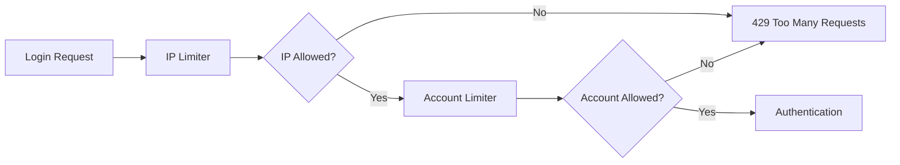

---

# 13. Redis Lua Rate Limiting

The rate-limiting operation is executed using a Redis Lua script.

Using a Lua script allows the related Redis operations to execute atomically.

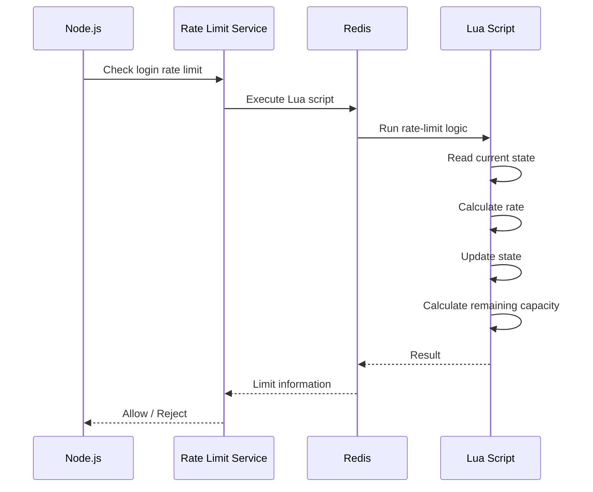

---

# 14. Rate Limit Response

When the login rate limit is exceeded:

```http
429 Too Many Requests
```

Example response:

```json
{
  "success": false,
  "message": "too many login requests"
}
```

The middleware also provides rate-limit information through response headers.

Examples include:

```text
RateLimit-Limit
RateLimit-Remaining
RateLimit-Reset
```

---

# 15. PostgreSQL

PostgreSQL is used for persistent user data.

The application uses a `users` table containing authentication-related information.

Example schema:

```sql
CREATE TABLE users (
    id SERIAL PRIMARY KEY,
    username VARCHAR(255) UNIQUE NOT NULL,
    password TEXT NOT NULL
);
```

Passwords are stored as bcrypt hashes.

---

# 16. Redis

Redis is used for temporary and high-speed authentication state.

Redis stores:

### Refresh Token State

```text
refresh:<tokenId>
```

### Login Rate-Limit State

```text
rate_limit:login:ip:<ip>
```

```text
rate_limit:login:account:<hashed-account>
```

The refresh-token state can automatically expire using Redis TTL.

---

# 17. Data Flow

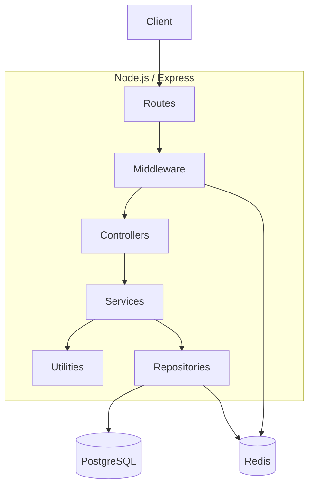

---

# 18. Token Lifecycle

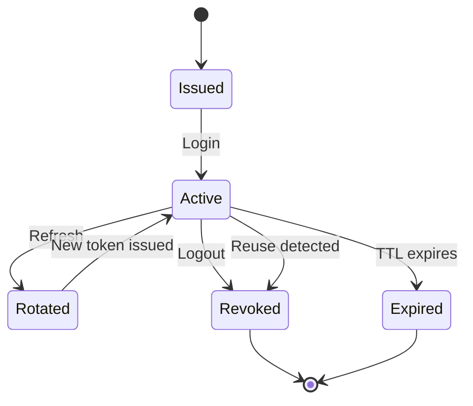

---

# Technology Stack

| Technology | Purpose |
|---|---|
| Node.js | JavaScript runtime |
| Express.js | Backend framework |
| PostgreSQL | Persistent user storage |
| Redis | Refresh-token state and rate limiting |
| ioredis | Redis client |
| JSON Web Token | Access and refresh tokens |
| bcrypt | Password hashing |
| cookie-parser | Cookie handling |
| dotenv | Environment configuration |
| UUID | Token identifiers |
| Axios | HTTP client |

---

# Environment Variables

Create a `.env` file in the project root.

```env
ACCESS_SECRET_KEY=your_access_secret_key
REFRESH_SECRET_KEY=your_refresh_secret_key

Dbhost=localhost
Dbuser=postgres
Dbport=5432
Dbpass=your_postgres_password
Dbdatabase=your_database_name
```

## Secret Key Security

Never commit `.env` to Git.

Use strong, cryptographically random values for:

```text
ACCESS_SECRET_KEY
REFRESH_SECRET_KEY
```

Keep access-token and refresh-token signing keys separate.

---

# Prerequisites

Install:

- Node.js
- npm
- PostgreSQL
- Redis

Verify Node.js:

```bash
node --version
```

Verify npm:

```bash
npm --version
```

Verify PostgreSQL:

```bash
psql --version
```

Verify Redis:

```bash
redis-server --version
```

---

# Installation

Clone the repository:

```bash
git clone https://github.com/ShanmukhaKommuri/node-jwt-authentication.git
```

Navigate to the project:

```bash
cd node-jwt-authentication
```

Install dependencies:

```bash
npm install
```

Create the PostgreSQL database.

Create the `users` table.

Configure the `.env` file.

Start Redis:

```bash
redis-server
```

Start the application:

```bash
npm run dev
```

The application runs on:

```text
http://localhost:3000
```

---

# API Endpoints

| Method | Endpoint | Authentication | Description |
|---|---|---|---|
| `POST` | `/register` | Public | Register a new user |
| `POST` | `/login` | Public + Rate Limited | Authenticate user |
| `POST` | `/refresh` | Refresh Cookie | Rotate refresh token |
| `POST` | `/logout` | Access Token | Revoke refresh tokens |
| `GET` | `/home` | Access Token | Protected resource |

---

# API Examples

## Register

```http
POST /register
Content-Type: application/json
```

```json
{
  "username": "john",
  "password": "password123"
}
```

---

## Login

```http
POST /login
Content-Type: application/json
```

```json
{
  "username": "john",
  "password": "password123"
}
```

Successful response:

```json
{
  "accessToken": "<access-token>"
}
```

The refresh token is sent through an HTTP-only cookie.

---

## Protected Endpoint

```http
GET /home
Authorization: Bearer <access-token>
```

Example response:

```json
{
  "message": "Welcome john"
}
```

---

## Refresh

```http
POST /refresh
```

The browser sends the refresh-token cookie.

The server:

1. Verifies the refresh JWT.
2. Extracts the token ID.
3. Looks up the token in Redis.
4. Checks whether the token is valid.
5. Invalidates the existing token.
6. Creates a new access token.
7. Creates a new refresh token.
8. Stores the new refresh-token state in Redis.
9. Sends the new refresh token through the HTTP-only cookie.

---

## Logout

```http
POST /logout
Authorization: Bearer <access-token>
```

The server revokes refresh-token state and clears the refresh-token cookie.

---

# Security Model

The project uses multiple security mechanisms.

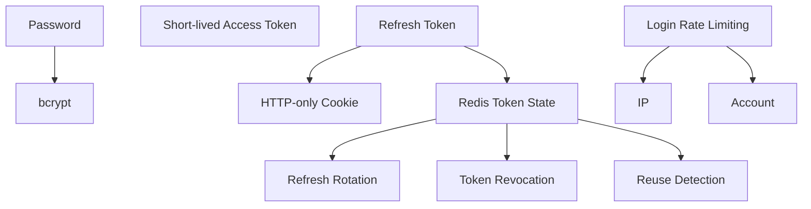

### Security controls

1. Password hashing with bcrypt
2. Short-lived access tokens
3. HTTP-only refresh-token cookies
4. Separate access and refresh signing secrets
5. Refresh-token rotation
6. Server-side refresh-token state
7. Refresh-token revocation
8. Refresh-token reuse detection
9. Redis-based login rate limiting
10. IP-based login protection
11. Account-based login protection

---

# Why Use Short-Lived Access Tokens?

If an access token is long-lived and stolen, the attacker can use it until it expires.

Using a short-lived token reduces the exposure window.

```text
Login
  ↓
Access Token
  ↓
15 minutes
  ↓
Expires
  ↓
Refresh Token
  ↓
New Access Token
```

---

# Why Use Redis for Refresh Tokens?

JWT access tokens are stateless, but long-lived refresh tokens require more control.

Redis allows the application to:

- Track refresh-token validity
- Rotate tokens
- Revoke tokens
- Detect reuse
- Expire token state automatically
- Revoke all refresh tokens for a user

Therefore:

```text
Access Token
    ↓
Stateless JWT
    ↓
Fast authorization


Refresh Token
    ↓
JWT + tokenId
    ↓
Redis
    ↓
Stateful control
```

---

# Why Use Refresh Token Rotation?

Without rotation:

```text
Refresh Token
      ↓
Valid for 7 days
      ↓
Can repeatedly be used
```

With rotation:

```text
Refresh Token A
      ↓
     Use
      ↓
Invalidate A
      ↓
Issue B
      ↓
     Use
      ↓
Invalidate B
      ↓
Issue C
```

This significantly improves control over long-lived refresh credentials.

---

# Why Use Login Rate Limiting?

Authentication endpoints are common targets for:

- Brute-force attacks
- Credential stuffing
- Password spraying
- Automated login attempts
- Account targeting

Using both IP and account-based rate limits provides two layers of protection.

```text
                    Login
                      │
            ┌─────────┴─────────┐
            │                   │
        IP limit           Account limit
            │                   │
            └─────────┬─────────┘
                      │
                  Allowed?
                 /        \
               Yes         No
                │           │
             Login         429
```

---

# Error Responses

## Invalid Credentials

```http
401 Unauthorized
```

```json
{
  "message": "Invalid credentials"
}
```

## Missing Access Token

```http
401 Unauthorized
```

## Invalid or Expired Access Token

```http
403 Forbidden
```

## Refresh Token Reuse

```http
403 Forbidden
```

```json
{
  "message": "Refresh token reuse detected"
}
```

## Rate Limit Exceeded

```http
429 Too Many Requests
```

```json
{
  "success": false,
  "message": "too many login requests"
}
```

---

# Design Principles

## Separation of Concerns

```text
Controller
    ↓
Service
    ↓
Repository
    ↓
PostgreSQL / Redis
```

Each layer has a specific responsibility.

## Stateless Access Authentication

Access tokens can be verified without performing a database lookup for every protected request.

## Stateful Refresh Authentication

Refresh tokens have server-side state in Redis.

This allows the application to control their lifecycle.

## Defense in Depth

The system does not depend on a single security mechanism.

```text
bcrypt
  +
JWT
  +
HTTP-only Cookies
  +
Redis
  +
Rotation
  +
Revocation
  +
Reuse Detection
  +
Rate Limiting
```

---

# Learning Objectives

This project demonstrates practical implementation of:

- JWT authentication
- Access tokens
- Refresh tokens
- Stateless authentication
- Stateful authentication
- Refresh-token rotation
- Refresh-token revocation
- Refresh-token reuse detection
- HTTP-only cookies
- Password hashing
- Redis
- PostgreSQL
- Express middleware
- Repository pattern
- Service-layer architecture
- Redis-based rate limiting
- Lua scripting
- Authentication security

---

# Project Status

**Learning / Portfolio Project**

This project was created to understand and implement modern authentication patterns using Node.js, Express, PostgreSQL, and Redis.

---

# Author

**Shanmukha Kommuri**

GitHub:

https://github.com/ShanmukhaKommuri

Repository:

https://github.com/ShanmukhaKommuri/node-jwt-authentication

---

# License

This project is licensed under the **ISC License**.
